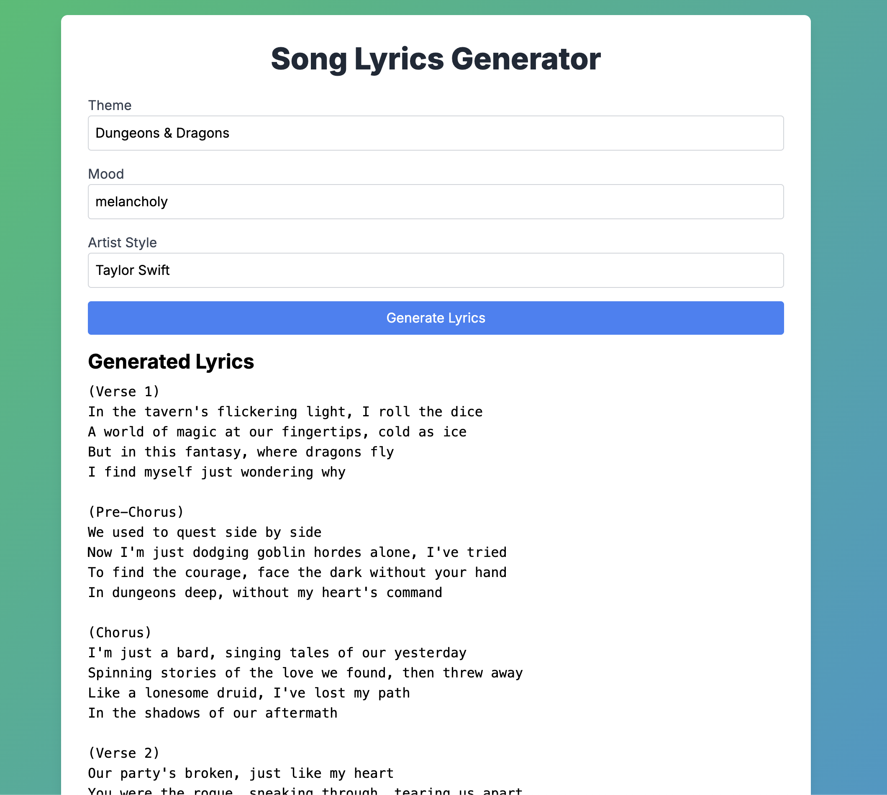

# AI Lyrics Generator

Welcome to my Next.js application! This project leverages OpenAI's API to generate song lyrics.

## Getting Started

### Prerequisites

Before you can run this application, you'll need to set up an OpenAI API key. 

1. **Create an OpenAI Account**: If you don't have one already, sign up at [OpenAI](https://www.openai.com/).
2. **Obtain Your API Key**: After signing in, you can find your API key in the OpenAI dashboard.

### Installation

1. **Clone the Repository**

   ```bash
   git clone
   ```

2. **Navigate to the Project Directory**
   
    ```bash
    cd your-repository
    ```

3. **Install Dependencies**
    
    ```bash
    npm install
    ```

4. **Set Up Environment Variables**

    Create a .env.local file in the root of the project and add your OpenAI API key:

    ```plaintext
    OPENAI_API_KEY=your_openai_api_key
    ```

5. **Running the Application**
    
    ```bash
    npm run dev
    ```

## Using the Application

Fill in props and click `generate lyrics`



